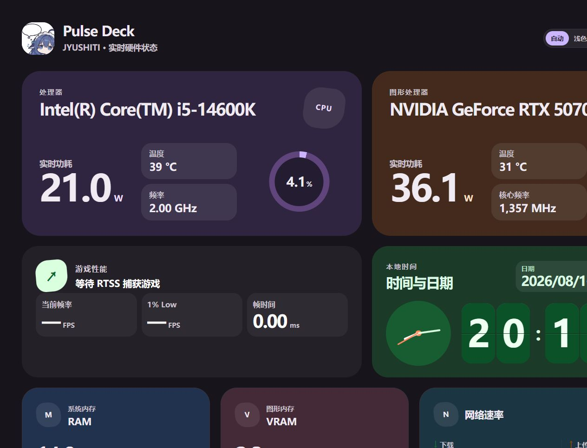

# Pulse Deck

Pulse Deck 是一个常驻 Windows 系统托盘的局域网硬件监控面板。它从 MSI Afterburner 的 MAHM 共享内存读取实时指标，并通过网页提供给同一局域网内的手机、平板和其他电脑查看。


## 预览



## 功能

- CPU：名称、频率、占用率、功耗、温度
- GPU：名称、核心频率、占用率、功耗、温度、显存占用
- 内存占用与网络上传/下载速度
- RTSS 当前帧率、1% Low 与帧时间
- Material Design 3 Expressive 响应式界面
- 系统托盘、局域网地址复制、随 Windows 启动
- SSE 自适应实时推送：游戏运行时每 500 ms 更新，空闲时每 1000 ms 更新；页面从后台恢复时自动刷新并重连
- 公网模式：白名单公开硬件核心指标，并限制 SSE 长连接数量

## 使用

1. 安装并保持 MSI Afterburner 在后台运行。
2. 如需游戏帧率数据，同时运行 RivaTuner Statistics Server（RTSS）。
3. 安装并启动 Pulse Deck。首次启动若出现 Windows 防火墙提示，请只允许“专用网络”。
4. 双击托盘图标打开本机面板，或右键托盘图标选择“复制局域网地址”，发送到其他设备访问。

默认地址为 `http://localhost:5174`，也可使用 `PulseDeck.exe --port 端口号` 指定端口。

### 公网访问

若通过 Cloudflare Tunnel 等方式公开面板，请在托盘菜单开启“公网模式（隐藏设备信息）”。开启后：

- `/api/metrics` 与 `/api/stream` 仅输出 CPU/GPU 型号、频率、占用、功耗、温度、RAM/VRAM、FPS/1% Low/帧时间及网络速率。
- 设备名、局域网地址、传感器状态与详细错误、服务版本和时间戳均不会出现在公网 API；`/api/info` 会返回 `404`。
- SSE 最多保留 12 条连接；能够识别客户端 IP 时，同一 IP 最多 3 条，超出会收到 `429` 并在 15 秒后重试。

该开关会保存到当前 Windows 用户。也可从命令行启动一次 `PulseDeck.exe --public` 来开启，或使用 `PulseDeck.exe --private` 关闭。

> 不同硬件和驱动能否提供某项传感器，取决于 MSI Afterburner 暴露的监控源。CPU 功耗读取使用 Afterburner 的 CPU power 数据源。

## 隐私

Pulse Deck 不包含云服务、账号系统或遥测。硬件数据只由本机 HTTP 服务提供。需要公开访问时，请使用 HTTPS 反向代理或 Cloudflare Tunnel，并开启公网模式；不要把本机端口直接暴露到公网。

## 从源码构建

需要 .NET 8 SDK 和 Windows 10/11：

```powershell
dotnet build collector\PulseDeck\PulseDeck.csproj -c Release
dotnet run --project collector\PulseDeck\PulseDeck.csproj -- --port 5174
```

生成自包含的发布包和安装程序：

```powershell
powershell -ExecutionPolicy Bypass -File installer\build-installer.ps1
```

构建结果位于 `artifacts\release`。

## 技术说明

- 运行平台：Windows x64
- 后端：ASP.NET Core 8 + Windows Forms 托盘
- 数据源：MSI Afterburner MAHM SharedMemory、RTSS、Windows 网络接口统计
- 前端：原生 HTML、CSS、Canvas 与 JavaScript
